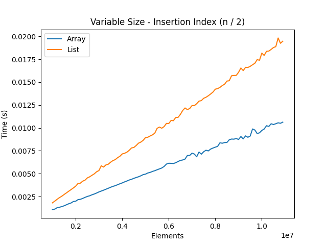
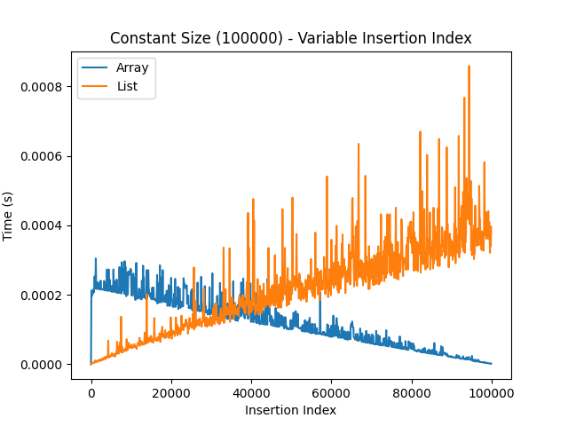
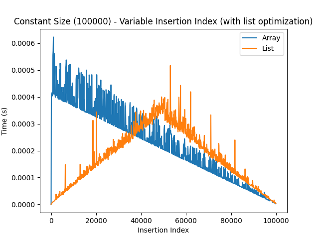
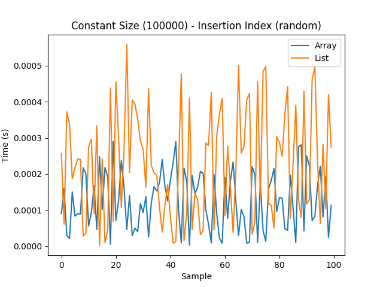
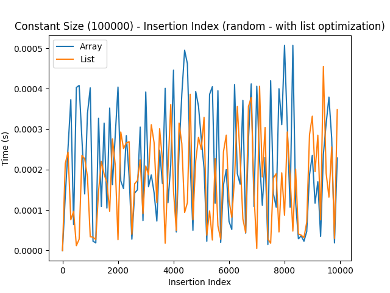
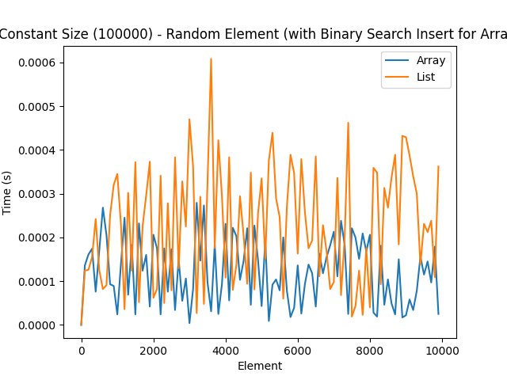

# Usage
Get the codebase.

```
git clone https://github.com/seandavidreed/array_vs_lists.git
cd array_vs_lists
```

Install Python libraries `pandas` and `matplotlib`.

- [pandas installation](https://pandas.pydata.org/pandas-docs/stable/getting_started/install.html)
- [matplotlib installation](https://matplotlib.org/stable/install/index.html)

Run the bash script with an argument specifying which test to run.

```
./run_test.sh <arg>
# Example: ./run_test.sh 2
```

Arguments:

1. Insert into the middle of each data structure with sizes ranging $`[1,\ 1000000]`$. 
2. Varied insertion indexes $`[1,\ 1000000]`$ with data structures of constant size $`100000`$.
3. Same as test 2, but with an added optimization for the list: linear search can start from either the head or tail depending on which is more optimal for the given insertion index.
4. Random insertion indexes with data structures of constant size $`10000`$.
5. Same as test 4, but with the same list optimization as before.

# Purpose of This Codebase
## Bjarne Stroustrup’s Claim
[Vector vs. List](https://youtu.be/SfkMiGFVhZo?si=vDlHbAw8UEf-0nOY&t=44m50s)

## Vectors are generally better than linked lists
Common reasoning says that if you need a data structure that supports frequent element insertions, a _linked list_ with its $`O(1)`$ insertion time is a better choice than a _vector_ with its $`O(m)`$ insertion time, where $m$ is the number of elements that must be right-shifted to make space. However, this misses the point that linear search must always be conducted first to _find_ the insertion point in a list, and that will also take $`O(m)`$, where $`m`$ is the number of nodes that must be stepped through. In terms of insertion cost then, lists and vectors are quite similar.

What makes vectors superior is their compactness and predictability, attributes that are achieved with contiguous memory allocation. Lists, on the other hand, are scattered throughout memory. It is simply more efficient to iterate through contiguous memory than non-contiguous memory.

Moreover, the vector can make use of the CPU cache, which can pre-fetch large batches of the data all at once. This is only possible because the data is contiguous. To pre-fetch a batch of nodes of a list would require stepping through each one, which is not pre-fetching a batch at all and really no better than just fetching individual nodes directly from memory.

## Maybe Demonstrating the Superiority of Vectors Over Lists
I put Bjarne Stroustrup's words to the test by creating dynamic arrays and linked lists in C and putting them through several tests. I experimented with insertions into both data structures. Here are the tests I used.
1. Insert into the middle of each data structure with sizes ranging $`[1,\ 1000000]`$. 
2. Varied insertion indexes $`[1,\ 1000000]`$ with data structures of constant size $`100000`$.
3. Same as test 2, but with an added optimization for the list: linear search can start from either the head or tail depending on which is more optimal for the given insertion index.
4. Random insertion indexes with data structures of constant size $`10000`$.
5. Same as test 4, but with the same list optimization as before.
Findings:
1. Test 1 shows that when inserting into the middle of a data structure, no matter the size, the array is more efficient than the list. This seems to coincide with Stroustrup's argument that the lists linear search is the bottleneck that makes the difference.
2. Tests 2 and 3 show that the list has an advantage when inserting near the beginning, but as the insertion index moves toward the middle, the array gains the advantage in more than half the cases. Optimizing the list by allowing linear search to start from the head _or_ the tail based on which is closer to the target index seems to give the list a better efficiency than the array. However, the list still suffers from a higher variance in runtime, possibly due to its non-contiguity.
3. Tests 4 and 5 demonstrate the same thing as Tests 2 and 3, but with a different perspective, using random indexes to show what an in-practice example might look like. Test 4 shows that in general the array performs better than the list. However, in test 5, when the list optimization is introduced, they seem to enjoy near equal efficiency.
4. Generally speaking, these two data structures can be made to have similar run times, but the array still wins in terms of compactness, predictability, and its ability to make use of the CPU cache.

## Results






